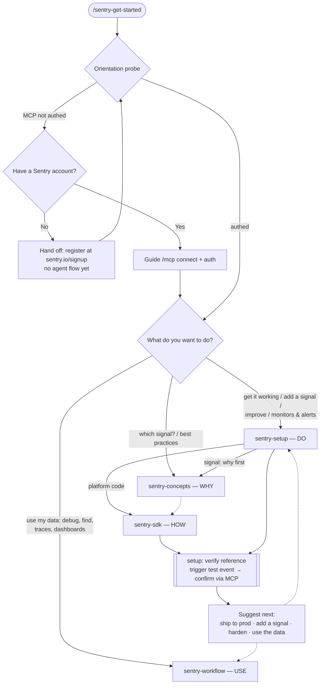

# `/sentry-get-started` — Design Brainstorm

Working doc. Goal: make the Sentry plugin *the* entrypoint for using Sentry through an
agent. A user installs the plugin, runs one command, and gets walked into whatever they
actually need — without us burning their token quota guessing.

> **Architecture note (supersedes the four-skill model below).** The skill design has moved from
> four layered skills (WHY/DO/HOW/USE) to **task-shaped skills + a shared `references/` library** —
> see [proposed-skills.md](./proposed-skills.md). Skills are now the tasks a user names
> (`sentry-instrument`, `sentry-debug-issue`, …); concepts and per-SDK code are reference documents
> copied into each skill at build time. The principles, probe, and menu below still hold; the
> *Flows* and *Master flow* sections still describe the old four-skill routing and are pending a pass
> to the task-skill shape.

---

## Design principles

1. **Orient cheaply, then let the user drive.** The command opens with a tiny, fixed-cost
   probe (≤3 signals) and a short menu. No deep repo crawl, no reading SDK skills, until
   the user picks a direction. Expensive work happens *after* intent is known.

2. **Always offer a menu, never an interrogation.** Suggest concrete options ("here's what
   I can do right here") instead of asking open-ended questions. One line: *"Sentry in your
   agent can do almost everything you'd do in the Sentry web UI."*

3. **Close the loop.** The thing no current skill does: after instrumenting, use the MCP to
   *confirm the event actually landed*. Setup isn't "done" until we've seen it in the stream.

4. **Aspire to do everything; be honest about what we've built so far.** The goal is the agent
   can do anything you'd do in the Sentry web UI. Some of that is built today (errors, tracing,
   logs, crons…), some isn't yet. The honest framing is about *our current coverage*, not an
   inherent limit in Sentry — most "UI-only" things (uptime, alerts, dashboards) are reachable
   via the Sentry API; we just haven't built the skill for them. When a user asks for something
   we can't yet do end-to-end, say so plainly and offer the best fallback: *"The agent can't set
   this up directly yet, but I can read the Sentry docs and walk you through doing it in the
   UI."* (Or, where an API path exists, script it.) Never silently pretend it's a UI-only task.

   *Longer-term unlock:* a generic "drive the Sentry API from the OpenAPI spec" capability would
   collapse most of these gaps at once — worth keeping in mind as the structural fix rather than
   one bespoke skill per feature.

5. **Route into task skills; share the references.** `/sentry-get-started` is a thin concierge that
   orients the user and routes into a **task-shaped skill** (`sentry-instrument`,
   `sentry-debug-issue`, …), not a reimplementation. The skills share a maintained `references/`
   library (per-platform SDK code, per-signal concepts, the query grammar, the verify loop) that the
   build copies into each skill so every shipped skill is self-contained. See
   [proposed-skills.md](./proposed-skills.md) for the full skill design.

---

## Step 0 — Orientation probe (cheap, runs once)

Three signals decide every branch. All are fast and low-token:

| Signal | How | Cost |
|---|---|---|
| **Is the MCP connected & authed?** | `whoami` / `find_organizations` | 1 MCP call |
| **Does the repo already use Sentry?** | grep for `@sentry` / `sentry-sdk` / `sentry_sdk` / DSN | 1 local grep |
| **Do they have a Sentry org/project?** | `find_projects` (also confirms auth) | 1 MCP call |

From these three booleans the command picks a *default* path and presents the menu with the
most-likely option first.

**If the MCP isn't authed, don't assume it's just disconnected — it might mean the user has no
Sentry account at all.** So branch first on account existence, with a short two-option menu:

- **"I don't have a Sentry account yet"** → direct them to register
  (sentry.io/signup). *No agent flow for this yet — it's a hand-off + a link. (Gap below;
  candidate for a future "create account" flow once the API/onboarding supports it.)* Once
  they're signed up, they come back and connect the MCP.
- **"I have an account — help me connect Sentry via the MCP"** → walk them through `/mcp`
  connect/auth, then re-run the probe.

Only after the MCP is authed do we continue to the capability menu.

---

## The capability menu (what the command shows)

**The menu is conditional on the probe — never show the full wall by default.** This is core,
not a nicety:

- **Brand-new user** (no Sentry in the repo / no project): **don't show a menu at all — route
  straight into "Get Sentry working" (`sentry-setup` → first error).** Their only job is capturing a
  first error; the rest is noise until that works. Surface the other intents *after* the loop is
  closed.
- **Existing user** (Sentry already in the repo): show the relevant slice — add a signal, improve /
  harden, monitors & alerts, or use my data. Skip "Get Sentry working."
- **No auth / no account:** the only thing shown is the account/connect branch from Step 0.

The menu is organized by **what the user wants to do**. Each intent routes into one of the four
skills — *not* 1:1: `sentry-setup` (DO) and `sentry-workflow` (USE) are the two primary doing entry
points, while `sentry-concepts` (WHY) and `sentry-sdk` (HOW) are layers reached through them. The
intents below are the *full* set; the command shows the relevant slice.

**Get Sentry working** *(new to Sentry)* → `sentry-setup` (`instrumenting`) → `sentry-sdk`
- Capture your first error — provision project/DSN, install the SDK, trigger a test error, confirm.

**Add a signal** *(already have Sentry)* → `sentry-setup` orchestrates `sentry-concepts` (why) → `sentry-sdk` (how)
- Tracing / performance · Profiling · Logs · Metrics · Session Replay · Release health ·
  Cron monitoring · AI/LLM monitoring · User feedback

**Improve / harden my setup** → `sentry-setup` references
- Stack traces unreadable → source maps / debug symbols
- Releases — suspect commits & deployment tracking
- Data scrubbing / PII · Reduce volume / quota · Span streaming · OTel pipeline

**Monitors & alerts** *(Monitors → Issues → Alerts; mostly UI/API today — I enable the data + guide you)* → `sentry-setup` references
- Monitors: metric · cron · uptime · mobile-build · Alerts (triggers/filters/actions) · Dashboards

**Use my Sentry data** *(work with what's already flowing)* → `sentry-workflow`
- Debug a known issue (link/ID) · Find an issue I don't have a link for · Explore traces ·
  Read dashboards / releases / trends · `/seer` natural-language queries

**Understand what to instrument** → `sentry-concepts`
- Which signal (error / span / log / metric) and the strategy behind each — best practices, no code.

> "Or just tell me what you're trying to do." — always the escape hatch.

---

## Master flow

---

The journeys below all route through the four skills. `sentry-setup` (DO) owns getting Sentry
working, adding a signal, hardening, and monitors; `sentry-workflow` (USE) owns working with the
data. `sentry-concepts` (WHY) and `sentry-sdk` (HOW) are layers underneath.

## Flow: Get Sentry working (new user) — `sentry-setup` → `sentry-sdk`

The flagship journey. End-to-end, loop closed. Driven by `sentry-setup`'s `instrumenting` reference.

1. **Pick/create the destination** *(owned by `sentry-setup` → `instrumenting`)*. No project →
   `create_project` (mints project **and** DSN in one MCP call — no manual dashboard trip). Has one
   → `find_projects` to pick, `find_dsns` to read the DSN.
2. **Detect platform** and hand the ready DSN to `sentry-sdk`; confirm the SDK.
3. **Instrument minimally** — `sentry-sdk` install + `init({ dsn })`, scoped to error capture only.
   Defer tracing/etc.
4. **Close the loop** — `sentry-setup`'s `verify` reference: trigger a test error (incl. the
   who-boots-the-app decision) → auto-poll the MCP → confirm arrival.
5. **Suggest next** (don't pick for them): ship it to production · add a signal · harden the setup
   (source maps + releases are natural follow-ups) · start using the data.

## Flow: Add a signal (existing user) — `sentry-setup` orchestrates `sentry-concepts` → `sentry-sdk`

No new reference — `sentry-setup` orchestrates: `sentry-concepts` for the WHY (and "which signal?"
when unsure), then `sentry-sdk` scoped to that capability for the HOW, then `verify`. Don't force
the concept step when the user just says "add tracing, you pick the defaults."

Signals the agent can set up (HOW lives in `sentry-sdk`, strategy in `sentry-concepts`):

- **Tracing / performance** — `tracesSampleRate` or `tracesSampler`; auto-instrumentation; custom
  spans. (Let the user say "everything" vs. "just this endpoint.")
- **Profiling** — requires tracing; profiling integration + sample rate.
- **Logs** — `enableLogs`; capture calls + console/logger integration.
- **Metrics** — `count`/`gauge`/`distribution`. ⚠️ Never emit the removed v8
  `Sentry.metrics.increment` API.
- **Session Replay** — browser/mobile; sample rates + privacy masking.
- **Cron monitoring** — the check-in *code* (SDK decorator/`withMonitor`, HTTP, `sentry-cli`); the
  monitor *config* is a `sentry-setup` `cron-monitors` reference.
- **User feedback** — widget / `captureFeedback` / crash-report modal.
- **AI/LLM monitoring** — `sentry-setup`'s `ai-monitoring` reference (cross-SDK, not one platform).

## Flow: Improve / harden — `sentry-setup` references

"My Sentry works — make it better, cleaner, cheaper, safer, or current." Mixed coverage — be honest
about what's built (principle 4). Each is a `sentry-setup` reference:

- **`source-maps`** — readable JS/TS stack traces (bundler plugin / `sentry-cli sourcemaps`).
- **`debug-symbols`** — native/mobile symbolication (dSYM, ProGuard/R8).
- **`releases`** — suspect commits + CI deploy tracking (`getsentry/action-release`, sentry-cli);
  the `release`/`environment` tags live in `sentry-sdk` `init`, the WHY in `sentry-concepts`.
- **`code-mappings`** — connect the repo integration + map stack paths → source; the foundational
  prerequisite that unblocks suspect commits, stack-trace linking, code owners, and Seer.
- **`ownership-rules`** — route issues to teams/users by path/module/tag; import CODEOWNERS (the
  agent can write the rules and the CODEOWNERS file).
- **`seer-automation`** — configure Seer automation stop-points, `enableSeerCoding`, and handoff to
  a coding agent (the same agent running these skills).
- **`data-scrubbing`** — the server-side HOW (Safe/Sensitive fields + advanced rules engine); the
  SDK-side `beforeSend`/`sendDefaultPii` lives in `sentry-sdk`, and the PII strategy (WHY, incl. the
  `gen_ai.*`-not-scrubbed gotcha) is a `sentry-concepts` reference.
- **`reduce-volume`** — the server-side HOW (inbound filters, per-DSN rate limits, spike protection,
  Delete-&-Discard); SDK-side sampling lives in `sentry-sdk`, and the volume/cost strategy (WHY) is a
  `sentry-concepts` reference.
- **`span-streaming`** · **`otel-exporter`** — migrations.

The coding-agent superpowers live across `sentry-workflow` (apply the fix, resolve via a
`Fixes SENTRY-123` commit, receive a Seer handoff) and these setup references (`code-mappings`,
`ownership-rules`, `seer-automation`) — the differentiated value of an agent over a dashboard.

## Flow: Monitors & alerts — `sentry-setup` references

Sentry's model: **Monitors → Issues → Alerts.** A *Monitor* decides when a signal becomes an
**issue** (and sets priority / auto-resolve / assignee at creation); an *Alert* then acts on issues.
The model (WHY) is a `sentry-concepts` reference; each HOW is a `sentry-setup` reference. Mixed
coverage; honest hand-offs (principle 4):

**Monitors** (detect → create issues):
- **`metric-monitors`** — thresholds on errors/spans/logs/releases/app metrics (fixed / % change /
  dynamic anomaly). Creatable straight from a Discover or Metrics-Explorer query. (NB: "metric
  *alert*" is now a Metric *Monitor*.)
- **`cron-monitors`** — scheduled-job watch/config (the check-in *code* is a `sentry-sdk` signal).
- **`uptime-monitors`** — *not built end-to-end.* HTTP uptime; largely UI today.
- **`mobile-build-monitors`** — app-size thresholds; depends on size analysis (parked, see below).
- *Default monitors* (Issue Stream, Error) are auto-created per project — worth explaining, nothing
  to set up.

**Alerts** (act on issues):
- **`alerts`** — *built.* Sources (projects or monitors) → triggers (issue-state changes) → filters
  → actions (Slack, email, PagerDuty, Jira, webhooks), via the workflow-engine API (`alerts:write`).
  MCP can only *read* alert rules (useful to verify afterward).

**`dashboards`** — *not built end-to-end.* Visualize errors/spans/logs/releases; the agent's real
leverage is enabling the upstream data. This whole area is the prime candidate for the OpenAPI-driven
capability noted in principle 4.

## Flow: Use my Sentry data — `sentry-workflow`

The USE layer, for when Sentry is already set up and data is flowing. Four intent-based references:

- **`triage-issues`** → manage the issue lifecycle: resolve (incl. in-release / by-commit), archive,
  assign, set priority, merge/unmerge, delete-&-discard (MCP `update_issue`).
- **`debug-issue`** → one issue → root cause → fix: locate it (`search_issues` / `search_events`),
  `get_issue_details`, `analyze_issue_with_seer` root-cause / autofix, apply the fix.
- **`explore`** → query the raw data: Discover, trace/span explorer (aggregates + group-by), logs
  search, metrics explorer, cross-event querying; then save-query-as → alert / monitor / dashboard.
- **`read-insights`** → higher-level views: profiles (flame graphs, regressions), replays (search,
  rage/dead clicks, AI summary), curated insight dashboards (DB queries, caches, queues, web/mobile
  vitals, AI agents), and usage/drop-reason stats.

Everything that takes a query runs on Sentry's `key:value` search grammar in
`sentry-concepts/references/search-query-language.md` — the shared vocabulary this layer (and
query-driven setup like alerts/monitors/dashboards) authors and interprets. Pairs with the `/seer`
command as the conversational entry point into the same data.

---

## Proposed skill tree

Moved to its own working doc — see **[proposed-skills.md](./proposed-skills.md)**, where we hone
in on exactly which Sentry skills we expose and how they're organized.

## Gaps in the current skill set (this is the interesting part)

Today's skills are organized around the *author's* mental model and assume the user already knows
their intent. Concrete gaps the four-skill design (and a get-started layer) addresses or exposes:

1. **No orientation entrypoint.** The only "menu" today is prose inside `SKILL_TREE.md`'s
   "Start Here" — not invocable. `/sentry-get-started` is net-new and routes across all four skills.
2. **Setup never closes the loop.** Every SDK reference ends with "go check your dashboard
   manually." Nothing uses the MCP to confirm arrival. **This is the highest-value thing to build**
   and it doesn't exist yet. Fix: `sentry-setup`'s `verify` reference — the shared
   trigger-test-event → poll-MCP → confirm step every task ends with, so no individual flow
   reimplements it.
3. **No clean "add a signal" route for existing users.** Today signals live only as `references/`
   *inside* each SDK skill, framed as first-time "setup," so a user who already has Sentry and wants
   to "add logging" has no clean path. The four-skill design fixes this: `sentry-setup` orchestrates
   `sentry-concepts` (why) → `sentry-sdk` (how) for any signal.
4. **Uptime has no programmatic path** — pure UI. Worth confirming whether sentry-cli/API can
   do it yet; if not, it's a permanent hand-off (`sentry-setup`'s `uptime-monitors` reference).
5. **Alerts/monitors are read-only over MCP.** Creation is API-only (`sentry-setup`'s `alerts`
   reference). Fine, but the flow should set expectations.
6. **No account-creation flow.** If the user has no Sentry account, all we can do is hand off a
   signup link — there's no agent-driven onboarding for it yet. Currently a hard stop at the
   orientation step.

---

## Decisions made

1. **Packaging: slash command.** `/sentry-get-started`, like `/seer` — explicit, discoverable,
   user-triggered. A thin orchestration layer that routes into the four skills.
2. **Task-shaped skills + a shared `references/` library** *(supersedes the earlier four-skill
   WHY/DO/HOW/USE model)*. Each skill is one task a user would name (`sentry-instrument`,
   `sentry-debug-issue`, `sentry-create-monitor`, …) so model-invocation triggers cleanly. The
   layers that were skills — concepts (WHY) and per-SDK code (HOW) — become **reference documents**
   in a root library; single-consumer setup/HOW (source maps, alerts API) stays *in* its task skill.
   A per-skill `references.yml` declares which shared references to copy in, and the build hydrates
   them so every shipped skill is **self-contained**. See [proposed-skills.md](./proposed-skills.md).
3. **New-user project creation: auto-create with confirm.** Agent proposes `create_project`
   (mints project + DSN in one call) and creates it on a yes — smoothest zero-to-error path,
   but never silent since it's mutating.
4. **Verify loop is proactive.** The agent drives the loop — auto-polls the MCP after the test
   event rather than waiting for the user to say "I did it." (Cadence/timeout = implementation
   detail; falls back to "check your dashboard" after a reasonable window.)
5. **Token-budget guardrail lives in the command body.** The rule — *never read an SDK/feature
   skill before the user picks a direction* — is encoded directly in `/sentry-get-started`, not a
   separate skill.
6. **Uptime automation: deferred.** Not chasing whether the API can create uptime monitors right
   now; treat uptime as a UI hand-off until revisited.

## Dropped in the consolidation (call-outs)

Collapsing to four skills removed some capabilities the earlier drafts had. Flagging them so we
decide deliberately rather than by omission:

- **PR bot code review** — the old `sentry-code-review` / `sentry-pr-code-review` (respond to
  `sentry[bot]` and Seer bug-prediction comments on a PR) were removed. Responding to PR bot
  comments currently has **no home**. Candidate: a `sentry-workflow` reference, since it's "using
  Sentry's output." *Open.*
- **Enable AI code review** — turning *on* Sentry's AI review / bug prediction for a repo
  (`enable-ai-review`) was dropped. *Open: revisit as a `sentry-setup` reference?*
- **SDK upgrade** — major-version SDK upgrades (`sdk-upgrade`) was dropped. *Open: revisit as a
  `sentry-setup` maintenance reference alongside span-streaming / OTel?*
- **"What's possible" capability tour** — the old Flow C2 (explain what the agent can do *before*
  there's a fire) is no longer a distinct thing. Likely prose in the `sentry-workflow` intro or the
  get-started menu, not a skill. *Confirm where it lives.*
- **"Monitors" as a first-class product framing** — monitors/alerts are now `sentry-setup`
  references rather than their own surface. Fine for build-ability; just less prominent than
  Sentry's "Monitors" umbrella in the product. *Acceptable?*

## Still open

The task-skill reframe *dissolved* the two big earlier questions rather than answering them:

- ~~**Are WHY and HOW menu-facing?**~~ Resolved: they aren't menu items because they aren't tasks.
  Concepts and per-SDK code are **references**, pulled into task skills, never surfaced as skills.
- ~~**Is `sentry-setup` too big?**~~ Resolved: there is no `sentry-setup`. Each former reference is
  its own task skill (`sentry-fix-stack-traces`, `sentry-create-monitor`, …).

Open under the new shape:

- **Token guardrail** still holds: never read a `references/` file before the user's intent is known.
  The build hydrates copies into each skill, so the guardrail is now per-skill — load the skill's
  references only once routed there.
- **`references.yml` authored vs. derived.** We're starting hand-authored (with the build-time
  link-validator as backstop). Open whether to auto-derive concept needs from SKILL.md links later.
- **Does `/sentry-get-started` need any hydrated references of its own,** or is delegating to
  `sentry-instrument` (which carries the SDK refs) + reusing `setup-verification.md` through it
  enough? Currently assuming the latter — the command stays a flat, thin concierge.
- **Flows / Master flow sections above** still describe the old four-skill routing — pending a pass
  to the task-skill shape.

The earlier verify-loop, token-guardrail, and uptime questions are resolved in **Decisions made**.
