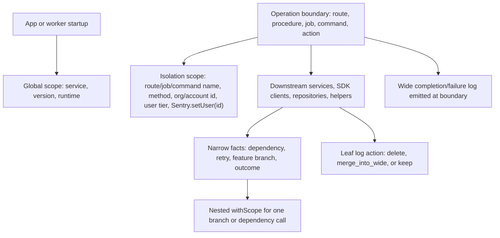
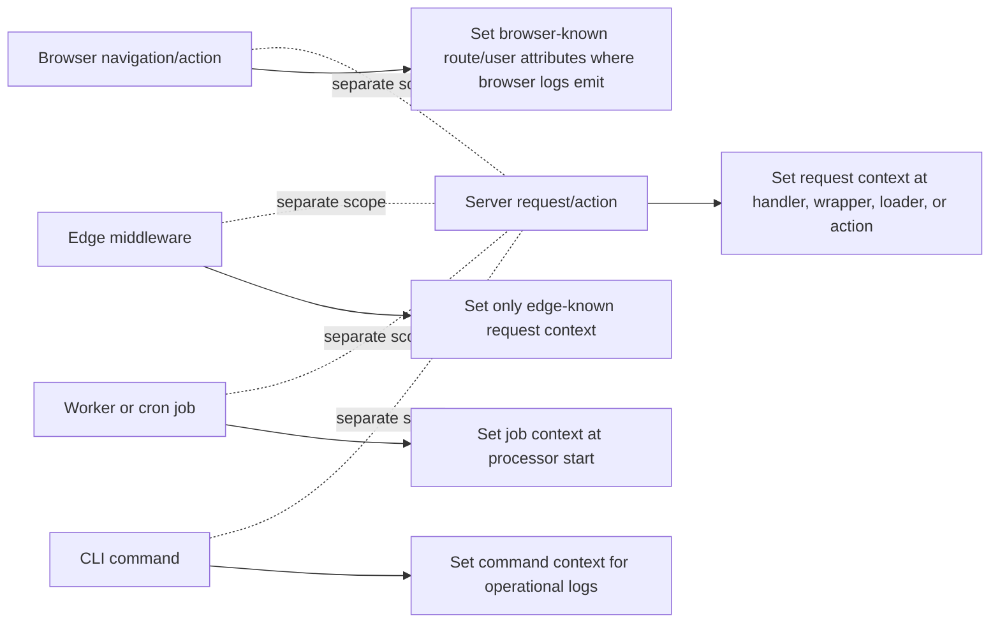

# Execution-flow mapping and router examples

Read this during Phase 0/2 when logs sit inside routers, nested route trees,
service layers, SDK clients, repositories, queue processors, CLI commands, or
shared helpers. Use it to decide where context belongs before editing call
sites. Add boundary context even when no current log exists at that boundary, so
downstream logs and errors are well contextualized.

## Context Ownership



Core rule: set broad context at the first boundary that knows it, even if that
requires adding scope setup before existing leaf logs. Deeper code should add
only narrower facts. Do not invent route, tenant, or user context in shared
helpers.

Wide logs are scope attributes + inline logger attributes; do not build mutable
`Sentry.logger` attribute objects.

## Runtime Surfaces



Scopes do not automatically cross browser, edge, server, worker, and CLI
runtimes. Map each runtime that emits logs.

## Flow-map Template

```text
Operation:
Runtime:
Entrypoint/router:
Boundary:
Downstream path:
Global scope:
Isolation scope:
Nested scope:
Wide event:
Leaf logs:
```

## Framework Notes

- Next.js App Router: Sentry init/instrumentation files are runtime setup;
  `app/layout` is a shell, not per-request scope. Set request isolation in route
  handlers, server actions, or route-specific wrappers that run for each
  request.
- Pages API / Express / Fastify / Hono: set isolation immediately after
  auth/body validation at the request handler or middleware boundary. Downstream
  services inherit context; emit the final wide log at response
  completion/failure.
- React Router / Remix / SPA: map root route -> loader/action/component event ->
  service calls. Browser isolation scope is effectively global, so keep it to
  stable page/user context; use `withScope` for action-only context. Server
  loaders/actions need their own server scope.
- tRPC / RPC routers: treat each procedure as the operation boundary after
  context/auth creation. Put tenant/user tier/procedure name on isolation scope
  in middleware or the procedure wrapper, not in leaf resolvers.
- Server actions / edge middleware: treat each runtime as separate. Set only the
  context known in that runtime, and do not assume browser, edge, and server
  scopes share attributes.
- Jobs / cron / queues: set global scope once at worker startup; set isolation
  at processor start with job type/id/tenant; emit the wide log in the job
  completion/failure path.
- CLI commands: keep intentional terminal output as `console.*` with scoped
  ESLint overrides if it is user-facing output. For operational logs, set
  command name/options on isolation scope and emit one completion/failure log.

## Example Boundary Map

```text
Operation: POST /checkout
Runtime: server request
Entrypoint/router: app/api/checkout/route.ts
Boundary: route handler after auth, before try/catch
Downstream path: checkoutService.createOrder -> cart.load -> payments.charge
Global scope: service=web, version=release (startup only)
Isolation scope: route.name=checkout.create, http.method=POST, org_id, user_tier, Sentry.setUser(id)
Nested scope: payment.provider inside payments.charge
Wide event: "Checkout completed" at route finally
Leaf logs:
- payments.ts:42 "stripe retry" -> keep as warn with payment scope if alerted
- cart.ts:18 "loaded cart" -> merge_into_wide via scope or final inline attrs
  as cart.item_count/cart.value_cents
- route.ts:31 "checkout hit" -> move_to_scope
```

## Leaf-service Rule

When a log lives in a shared helper, first ask: "who called this, and what
boundary did that caller enter through?" Shared code should usually emit only
local facts or use a narrow `withScope`.

```javascript
// Avoid: shared payment client invents broad request context.
Sentry.getIsolationScope().setAttributes({
  "route.name": "checkout.create",
  org_id,
});

// Prefer: boundary owns route/tenant context; helper only narrows the dependency.
Sentry.withScope((scope) => {
  scope.setAttribute("payment.provider", "stripe");
  Sentry.logger.warn("Payment provider retry", {
    retry_count,
    "payment.operation": "charge",
  });
});
```
